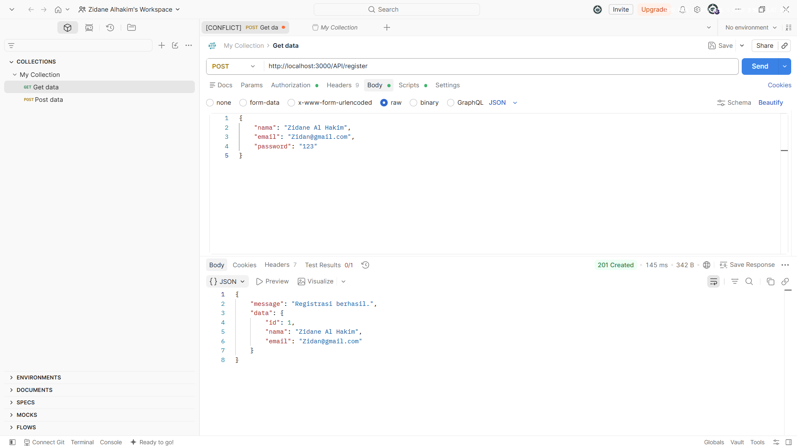
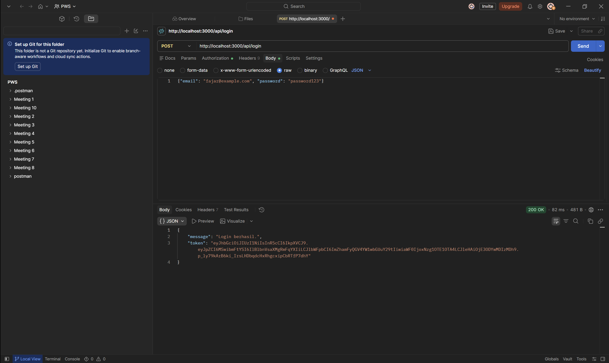
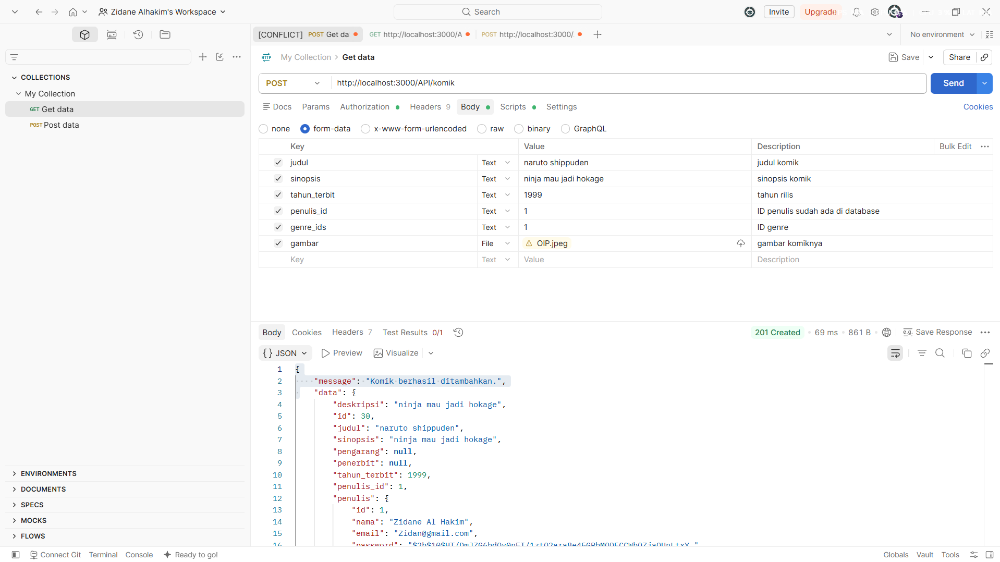
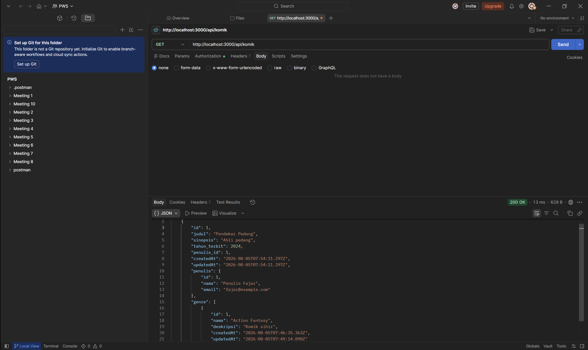
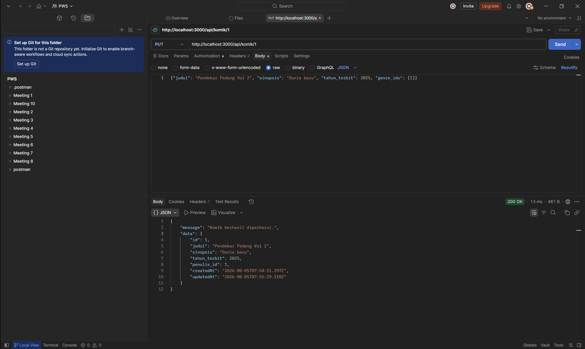
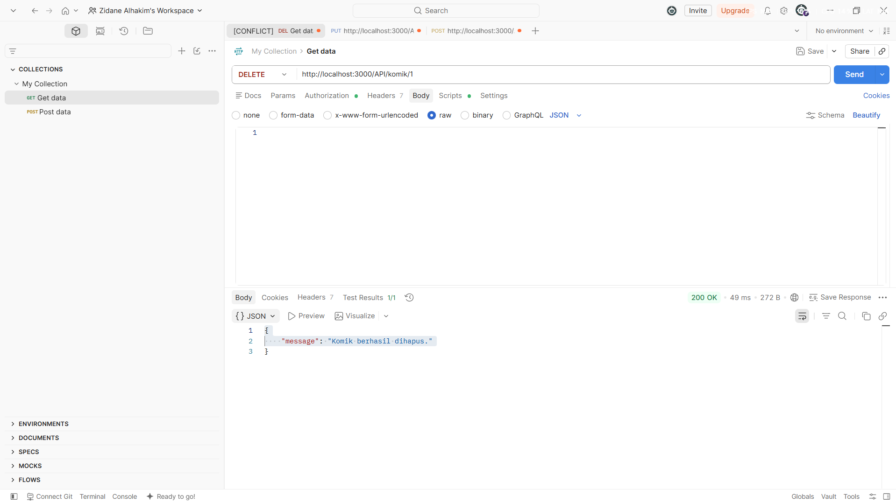
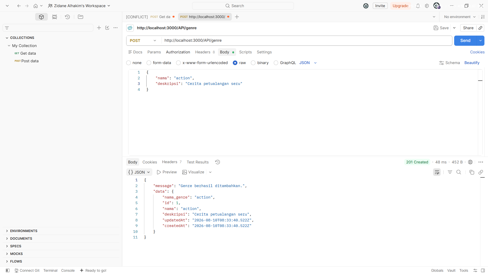
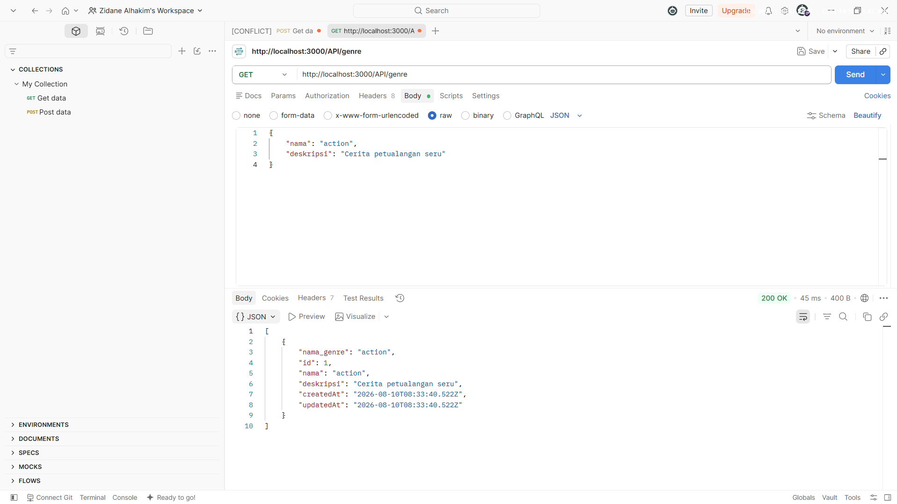
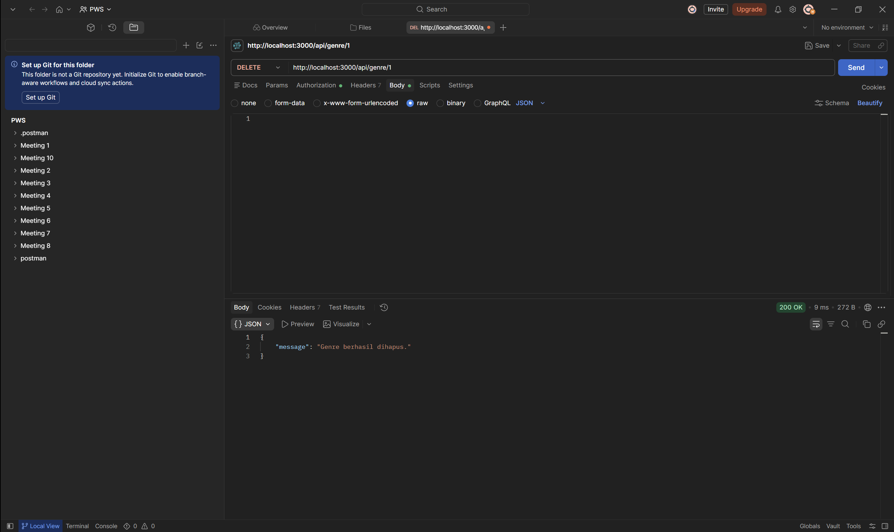

# 024_APIFile - Web Service API Komik, Genre, Penulis

Repository ini merupakan tugas Web Service API (**024_APIFile**) yang dibuat menggunakan Express.js, Sequelize ORM (PostgreSQL dengan fallback SQLite), JWT Authentication, serta Multer untuk unggah gambar komik.

---

## 🛠️ Instalasi & Menjalankan Project

1. Install dependencies:
   ```bash
   npm install
   ```

2. Jalankan server:
   ```bash
   npm start
   ```
   Server akan berjalan di `http://localhost:3000`.

---

## 🚀 Panduan Step-by-Step Pengujian Postman

Berikut adalah detail lengkap URL, Method, Body, Header, dan Auth yang digunakan di Postman untuk masing-masing request:

### 1. Register Penulis (User)
- **Method**: `POST`
- **URL**: `http://localhost:3000/api/register`
- **Headers**:
  - `Content-Type`: `application/json`
- **Body** (`raw` - `JSON`):
  ```json
  {
    "nama": "Zidane Alhakim",
    "email": "ac6@gmail.com",
    "password": "12345"
  }
  ```

### 2. Login Penulis
- **Method**: `POST`
- **URL**: `http://localhost:3000/api/login`
- **Headers**:
  - `Content-Type`: `application/json`
- **Body** (`raw` - `JSON`):
  ```json
  {
    "email": "ac6@gmail.com",
    "password": "12345"
  }
  ```
- **Catatan**: Salin nilai `token` dari response JSON untuk digunakan pada request berikutnya di bagian **Authorization**.

---

### 🔑 Pengaturan Authorization Token untuk Endpoint Berikutnya
Pada Postman tab **Authorization**:
- **Type**: `Bearer Token`
- **Token**: `<Paste Token Hasil Login>`

---

### 3. Tambah Genre (Post Genre)
- **Method**: `POST`
- **URL**: `http://localhost:3000/api/genre`
- **Auth**: `Bearer Token`
- **Headers**:
  - `Content-Type`: `application/json`
- **Body** (`raw` - `JSON`):
  ```json
  {
    "nama": "Aksi",
    "deskripsi": "Genre komik penuh pertarungan dan petualangan"
  }
  ```

### 4. Ambil Daftar Genre (Get Genre)
- **Method**: `GET`
- **URL**: `http://localhost:3000/api/genre`
- **Auth**: `Bearer Token`

### 5. Update Genre (Put Genre)
- **Method**: `PUT`
- **URL**: `http://localhost:3000/api/genre/1`
- **Auth**: `Bearer Token`
- **Headers**:
  - `Content-Type`: `application/json`
- **Body** (`raw` - `JSON`):
  ```json
  {
    "nama": "Aksi & Petualangan",
    "deskripsi": "Genre komik seru dan penuh aksi hebat"
  }
  ```

### 6. Hapus Genre (Delete Genre)
- **Method**: `DELETE`
- **URL**: `http://localhost:3000/api/genre/1`
- **Auth**: `Bearer Token`

---

### 7. Tambah Komik (Post Komik)
- **Method**: `POST`
- **URL**: `http://localhost:3000/api/komik`
- **Auth**: `Bearer Token`
- **Body** (`form-data` / `x-www-form-urlencoded` / `raw JSON`):
  - `judul`: `Naruto`
  - `sinopsis`: `Cerita seorang ninja yang bercita-cita menjadi Hokage.`
  - `tahun_terbit`: `1999`
  - `penulis_id`: `1`
  - `genre_ids`: `[1, 2]`
  - `gambar` *(File)*: Pilih file gambar komik (`.jpg` / `.png`)

### 8. Ambil Daftar Komik (Get Komik)
- **Method**: `GET`
- **URL**: `http://localhost:3000/api/komik`
- **Auth**: `Bearer Token`

### 9. Update Komik (Put Komik)
- **Method**: `PUT`
- **URL**: `http://localhost:3000/api/komik/1`
- **Auth**: `Bearer Token`
- **Body** (`raw` - `JSON` / `form-data`):
  ```json
  {
    "judul": "Naruto Shippuden",
    "sinopsis": "Lanjutan perjalanan Naruto berlatih bersama Jiraiya.",
    "tahun_terbit": 2007,
    "penulis_id": 1,
    "genre_ids": [1]
  }
  ```

### 10. Hapus Komik (Delete Komik)
- **Method**: `DELETE`
- **URL**: `http://localhost:3000/api/komik/1`
- **Auth**: `Bearer Token`

---

## 📸 Screenshots Hasil Pengujian Postman

### 1. Post Register


### 2. Post Login


### 3. Post Komik


### 4. Get Komik


### 5. Put Komik


### 6. Delete Komik


### 7. Post Genre


### 8. Get Genre


### 9. Put Genre


### 10. Delete Genre

